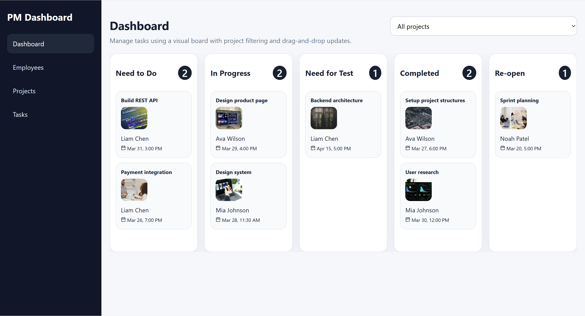
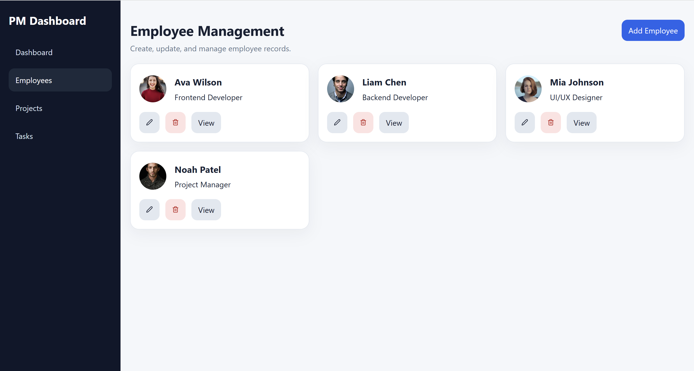
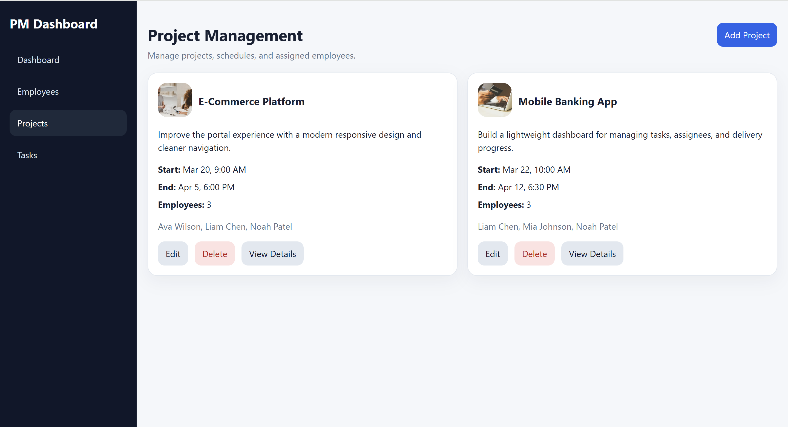
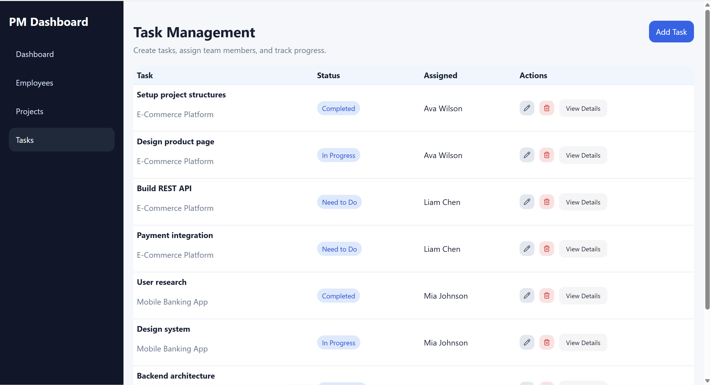

# 🚀 Project Management Dashboard

## 📌 Overview
A modern **Project Management Dashboard** built using React, Redux Toolkit, and React Router.  
This application helps manage **employees, projects, and tasks** with a clean UI, dynamic CRUD operations, and a visual workflow system.

The app demonstrates real-world frontend concepts like **state management, form validation, routing, and responsive design**.

---

## 🛠 Tech Stack
- React (Vite)
- Redux Toolkit
- React Router
- React Hook Form + Yup
- LocalStorage (Data Persistence)
- CSS (Custom responsive design)

---

## ✨ Features

### 👤 Employee Management
- Add, edit, delete employees
- Unique email validation
- Profile image upload with preview
- View employee details (modal)

---

### 📁 Project Management
- Create, update, delete projects
- Assign multiple employees
- Start & End date validation
- Project detail page with:
  - Assigned employees
  - Related tasks

---

### ✅ Task Management
- Full CRUD for tasks
- Assign tasks based on selected project
- Employee dropdown filtered by project
- Status tracking:
  - Need to Do
  - In Progress
  - Need for Test
  - Completed
  - Re-open

---

### 📊 Dashboard
- Visual task workflow board
- Grouped by task status
- Drag-and-drop between columns
- Project-based filtering

---

### 💾 Data Handling
- Managed using Redux Toolkit
- Persisted in localStorage
- Includes demo data loader

---

### 📱 Responsive Design
- Fully responsive layout
- Mobile sidebar navigation
- Optimized tables and cards for small screens

---

## 🧠 Key Functional Logic
- Prevent removing employees from projects if they have tasks
- Filter employees based on selected project
- Dynamic UI updates across:
  - Dashboard
  - Tasks
  - Projects
- Clean state synchronization between slices

---

## ⚙️ Setup Instructions

Clone repository :
```bash
git clone https://github.com/YOUR_USERNAME/project-management-dashboard.git
```
Navigate to project :
```bash
cd project-management-dashboard
```
Install dependencies :
```bash
npm install
```

Run development server :
```bash
npm run dev
```
## 📸 Screenshots

### Dashboard


### Employees Page


### Projects Page


### Tasks Page


## 🎥 Demo Video

[Watch Demo Video](https://drive.google.com/file/d/1WFDdo3QuEERT1fBfU8II-6MraD0hsuHU/view?usp=drive_link)

## 🌐 Live Demo

[Live Application](https://pm-dashboard-mouneesh.netlify.app)

## 👨‍💻 Author

**Mouneesh**  
Frontend Developer (React JS)

### ⭐ Notes

This project was built as part of a Frontend Developer Technical Task and focuses on clean architecture, usability, and real-world application logic.
